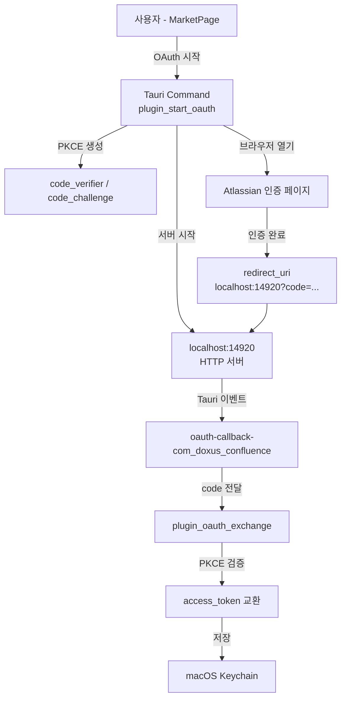
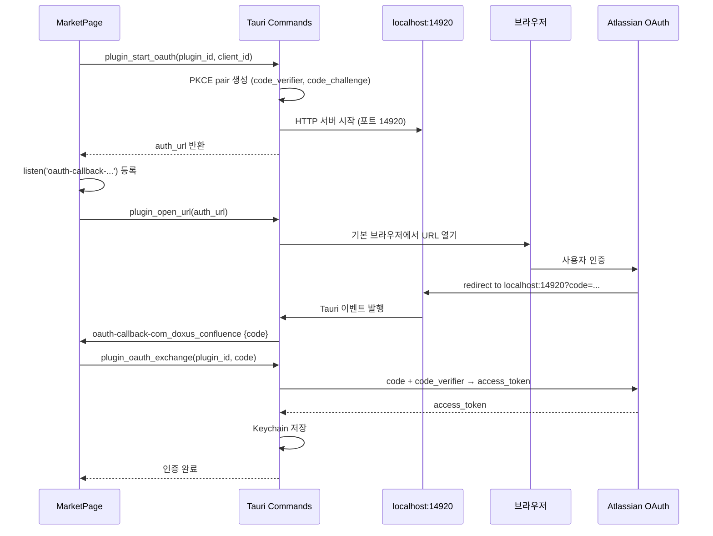

<!-- docsmith: auto-generated 2026-04-04 -->

# ADR-001: OAuth 콜백 방식 — Deep Link 대신 Localhost HTTP 서버

Confluence OAuth 2.0 콜백 수신 방법을 결정하는 아키텍처 의사결정 기록이다.

## 컨텍스트

doxus 데스크톱 앱에서 Confluence OAuth 2.0 인증 플로우를 구현할 때, 브라우저에서 인증 완료 후 앱으로 콜백을 전달하는 방법이 필요했다. Tauri 데스크톱 앱에서 사용 가능한 주요 방식은 두 가지다.

## 구조 개요

## 옵션 비교

### 옵션 A: Tauri Deep Link (`doxus://plugins/confluence/callback`)

- **장점**: 커스텀 URL 스킴으로 깔끔한 UX, 프로덕션 배포 시 표준 방식
- **단점**:
  - macOS에서 `.app` 번들 없이는 `LSSetDefaultHandlerForURLScheme`이 동작하지 않음
  - `cargo tauri dev` (dev 모드) 환경에서 테스트 불가
  - 개발/디버깅 사이클이 번거로움 (매번 번들 빌드 필요)

### 옵션 B: Localhost HTTP 서버 (`http://localhost:14920`) — **선택**

- **장점**:
  - dev 모드와 프로덕션 모두 동일하게 동작
  - OS 레벨 등록 불필요, 앱 시작 시 즉시 사용 가능
  - `tauri-plugin-oauth` 라이브러리로 간단하게 구현
- **단점**:
  - 포트를 고정해야 함 (Atlassian redirect_uri 정확한 매칭 필요)
  - 극단적인 방화벽 환경에서 localhost 포트 차단 가능성 (현실적으로 낮음)

## 설계 결정

**`tauri-plugin-oauth`를 사용하여 포트 14920에 localhost HTTP 서버를 운영하는 방식을 채택한다.**

추가 결정 사항:

1. **포트 14920 고정**: Atlassian OAuth 앱에 `http://localhost:14920`을 등록하고, `OauthConfig { ports: Some(vec![14920]) }`으로 고정
2. **Deep Link 코드 유지**: `tauri-plugin-deep-link`로 `doxus://` 스킴 등록은 유지 — 향후 프로덕션 macOS `.app` 배포 시 활용 가능
3. **PKCE 필수**: `client_secret`을 앱 바이너리에 포함하지 않음. Atlassian OAuth 2.0 public app으로 등록하고 `code_verifier`/`code_challenge`(SHA-256) 방식 사용
4. **토큰 저장**: 발급된 access_token은 macOS Keychain에 저장 (`secrets_get` Host Function으로 플러그인에 제공)

## 데이터 흐름

## 결과 및 검증

- dev 모드에서 Confluence OAuth 플로우 정상 동작 확인
- 포트 14920 고정으로 Atlassian redirect_uri 매칭 문제 해결
- race condition(리스너 미등록 상태에서 콜백 수신) 방지를 위해 리스너 등록 → 브라우저 열기 순서 확립

## 관련 문서

- [[2026-04-04-phase2d-plugin-auth-ui]]
- [[2026-04-04-confluence-oauth-troubleshooting]]
