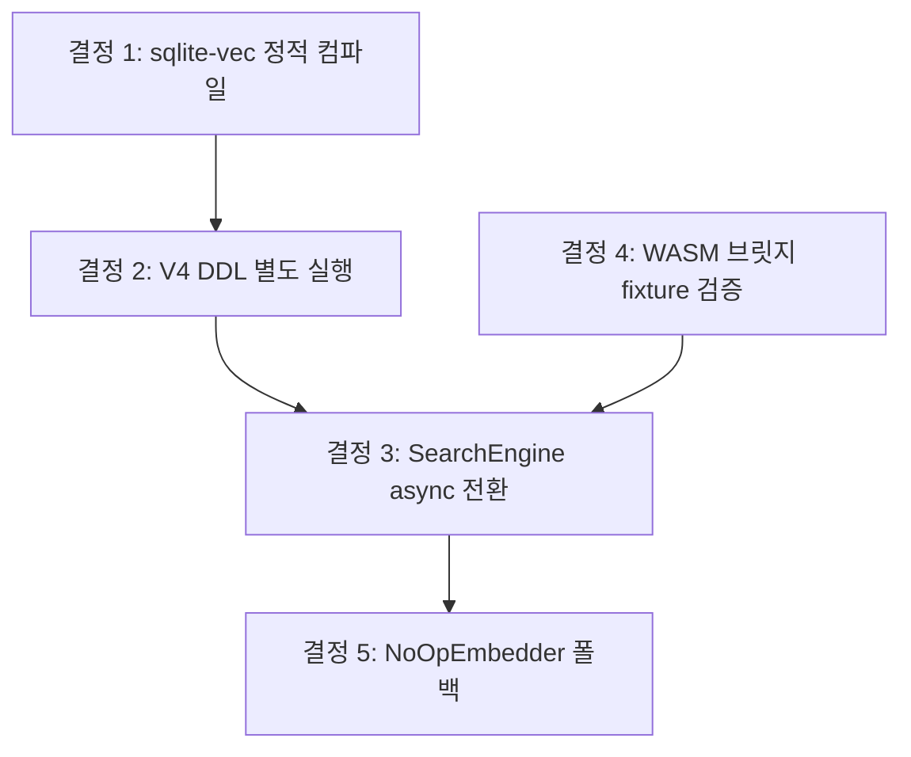

<!-- docsmith: auto-generated 2026-04-10 -->

# doxus 1순위 구현 설계 결정

이 문서는 doxus 1순위 구현 태스크(sqlite-vec 연동, WASM 브릿지 검증, mcp-server lib.rs 추출) 계획 수립 및 critic 리뷰(v1→v3) 과정에서 확정된 설계 결정 5건을 기록한다. 구현은 아직 시작하지 않았다.

---

## 결정 1: sqlite-vec 통합 방식 — build.rs + cc crate 정적 컴파일

### 배경

- workspace Cargo.toml의 rusqlite 의존성에 `load_extension` feature가 없었음 (`features = ["bundled"]` 만 선언)
- crates.io에 `sqlite_vec::load()` API를 제공하는 crate 없음 (phantom crate — 실제로 존재하지 않음)
- sqlite-vec는 SQLite 확장 모듈 형태로 배포되며, bundled SQLite와 충돌하지 않음

### 결정

sqlite-vec C 소스를 `build.rs` + `cc` crate로 정적 컴파일한다.

```
crates/core/sqlite-vec/sqlite-vec.c   ← sqlite-vec 릴리즈 소스
crates/core/build.rs                  ← cc::Build::new().file(...).compile("sqlite_vec")
```

workspace `Cargo.toml`에 rusqlite `load_extension` feature를 추가한다.

### 대안

| 대안 | 이유로 기각 |
|------|------------|
| 동적 라이브러리(`.dylib`/`.so`) 런타임 로드 | 배포 시 사용자 환경에 외부 바이너리 별도 설치 필요 |
| `sqlite_vec` crates.io crate 의존 | phantom crate — 실제 존재하지 않음 |
| `rusqlite` `load_extension` feature 없이 우회 | unsafe FFI 직접 호출 필요, 유지보수 부담 |

### 이유

정적 컴파일은 배포 시 외부 동적 라이브러리 의존성이 없어 가장 안정적이며, 로컬 퍼스트 원칙(오프라인 동작 보장)과도 일치한다.

### 영향 파일

- `crates/core/build.rs` (신규)
- `crates/core/sqlite-vec/sqlite-vec.c` (신규, sqlite-vec 릴리즈에서 복사)
- workspace `Cargo.toml` — rusqlite features 수정

---

## 결정 2: V4 vec0 DDL 마이그레이션은 MIGRATIONS 배열 밖에서 실행

### 배경

`crates/core/src/db/mod.rs`의 `migrate()` 함수는 `(array_index + 1)`을 version 번호로 사용하는 단순 인덱스 기반 방식이다.

현재 배열 순서:
```
[V1, V2, V3, V5, V6, V7, V8, V9]
```
기존 DB에는 이미 version 4 = V5 SQL, version 5 = V6 SQL … 로 기록되어 있다.

여기에 V4(vec0 DDL)를 재삽입하면:
- 배열 index 3 = version 4 → 기존 DB에서는 이미 version 4가 존재하므로 스킵됨
- 결과적으로 vec0 테이블이 생성되지 않고 silent failure 발생

### 결정

V4를 MIGRATIONS 배열에 삽입하지 않는다. 대신 `open()` 함수에서 sqlite-vec extension 로드 직후 별도로 실행한다.

```rust
// crates/core/src/db/mod.rs — open() 내부
sqlite_vec::load(&conn)?;
conn.execute_batch(
    "CREATE VIRTUAL TABLE IF NOT EXISTS chunk_embeddings USING vec0(
        embedding FLOAT[384]
    );"
)?;
```

### 대안

| 대안 | 이유로 기각 |
|------|------------|
| MIGRATIONS 배열에 V4 재삽입 | 기존 DB의 version 4~8 매핑 오염, silent failure |
| version 관리 시스템 전체 교체 (예: refinery) | 범위 초과, 기존 마이그레이션 체인 안정적으로 작동 중 |

### 이유

`IF NOT EXISTS`로 멱등성이 보장되므로 매번 `open()` 시 실행해도 안전하다. 기존 마이그레이션 버전 매핑을 오염시키지 않는 가장 단순한 방법이다.

### 영향 파일

- `crates/core/src/db/mod.rs` — `open()` 함수 수정

---

## 결정 3: SearchEngine 전체 async 전환 + Arc<Mutex<Connection>> 소유

### 배경

현재 `SearchEngine<'a>`는 `&'a Connection` lifetime을 보유하는 완전 sync 구조체이다.
`EmbeddingProvider::embed()`는 async trait 메서드이므로, sync 메서드 내에서 `block_on`으로 호출하면 tokio 런타임 내에서 deadlock 또는 panic이 발생한다.

### 결정

`SearchEngine`을 전체 async로 전환한다.

- `Connection`을 `Arc<Mutex<Connection>>`으로 소유 (lifetime 파라미터 제거)
- `embedder: Arc<dyn EmbeddingProvider>` 필드 추가
- `index_document()`, `search()` → `async fn`으로 변경
- SQLite 쿼리(sync)는 `tokio::task::spawn_blocking` 내부에서 실행

```rust
pub struct SearchEngine {
    db: Arc<Mutex<Connection>>,
    embedder: Arc<dyn EmbeddingProvider>,
}

impl SearchEngine {
    pub async fn search(&self, query: &SearchQuery) -> Result<SearchResults, SearchError> {
        let embedding = self.embedder.embed(&[&query.text]).await?;
        let db = self.db.clone();
        tokio::task::spawn_blocking(move || {
            // FTS5 + vec0 쿼리
        }).await?
    }
}
```

### 대안

| 대안 | 이유로 기각 |
|------|------------|
| caller에서 embedding(async)과 SQLite(sync) 분리 처리 | SearchEngine API가 분열됨, 사용 측 부담 증가 |
| `block_on` 사용 | tokio 런타임에서 deadlock/panic |
| 별도 blocking thread pool 관리 | spawn_blocking으로 충분, 복잡도만 증가 |

### 이유

embedding(async)과 SQLite(sync) 경계를 SearchEngine 내부에서 통합 관리하는 것이 API 일관성 측면에서 명확하다. Tauri command와 MCP server 모두 이미 async 컨텍스트이므로 호환성도 좋다.

### 영향 파일

- `crates/core/src/search.rs` — SearchEngine 구조체 및 모든 메서드
- `apps/desktop/src-tauri/src/commands/search.rs` — `.await` 추가 (이미 async)
- `crates/mcp-server/src/main.rs` — `.await` 추가
- `crates/core/tests/` — `#[tokio::test]` 추가

---

## 결정 4: Confluence/GitHub 플러그인은 현재 native Rust 유지 — WASM화는 별도 Phase

### 배경

설계 문서(architecture.md, plugin-system.md)에는 Confluence/GitHub이 WASM 플러그인으로 기술되어 있다. 그러나 코드베이스 탐색 결과:

- 두 플러그인 모두 native Rust (`impl DocSource`)로 구현되어 있음
- `WasmDocSourceAdapter`의 `fetch_all`/`fetch_document`에 연결할 실제 WASM 바이너리 없음
- `call_wasm` 경로 자체는 구조만 잡혀 있는 상태

### 결정

Task 2(WASM 브릿지 검증)는 Confluence/GitHub을 WASM화하는 대신, 최소 WASM test fixture를 별도로 빌드하여 `call_wasm` 경로만 검증한다.

```
crates/plugins/tests/fixtures/test_plugin.wasm   ← 최소 구현 (fetch_document 반환만)
```

Confluence/GitHub의 WASM화는 Phase 2b 재개 시 별도 태스크로 추적한다.

### 대안

| 대안 | 이유로 기각 |
|------|------------|
| Confluence를 즉시 WASM으로 재작성 | 작업 범위 초과, 이번 태스크 목적은 구조 검증 |
| WASM 브릿지 검증 전체 스킵 | call_wasm 경로 미검증 상태로 Phase 진행 — 위험 |

### 이유

구조(WASM 브릿지) 검증은 가능하고 필요하다. 그러나 실제 플러그인 WASM화는 별개의 큰 작업이므로 범위를 분리하는 것이 타당하다.

### 영향 파일

- `crates/plugins/tests/fixtures/` (신규 — test fixture WASM)
- `crates/core/src/plugin/wasm_adapter.rs` — test 경로 추가
- Phase 2b 태스크 트래커에 "Confluence/GitHub WASM화" 등록 필요

---

## 결정 5: ONNX 모델 미설치 시 FTS 전용 모드로 graceful degrade

### 배경

SearchEngine 초기화 시 `~/.doxus/models/` 아래 ONNX 모델 파일이 없을 수 있다 (신규 설치, 오프라인 환경 등). 하이브리드 검색(FTS5 + 벡터)이 doxus의 핵심 가치이나, 모델 파일 부재로 앱 전체가 실패하는 것은 로컬 퍼스트 원칙에 위배된다.

### 결정

모델 로드 실패 시 `NoOpEmbedder`(기존 `MockEmbedder` rename)로 폴백하고, FTS 전용 모드로 동작한다. 경고 로그를 출력하며 에러는 아니다.

```rust
let embedder: Arc<dyn EmbeddingProvider> = match OnnxEmbedder::load(&model_path) {
    Ok(e) => Arc::new(e),
    Err(err) => {
        tracing::warn!("ONNX model not found, falling back to FTS-only mode: {err}");
        Arc::new(NoOpEmbedder)
    }
};
```

`NoOpEmbedder`는 빈 벡터를 반환하며, RRF 계산 시 벡터 점수는 0으로 처리되어 FTS 결과만 랭킹된다.

### 대안

| 대안 | 이유로 기각 |
|------|------------|
| 모델 없으면 초기화 에러 | 로컬 퍼스트 원칙 위반, 오프라인 사용 불가 |
| 모델 없을 때 검색 기능 전체 비활성화 | FTS 검색까지 막을 이유 없음 |

### 이유

로컬 퍼스트 원칙 — 오프라인/모델 미설치 환경에서도 기본 검색(FTS)은 동작해야 한다. ONNX 모델은 첫 실행 후 다운로드하거나 수동 설치하는 방식을 상정하므로, 미설치 상태는 정상적인 초기 상태다.

### 영향 파일

- `crates/core/src/embedding.rs` — `NoOpEmbedder` 추가 (MockEmbedder rename)
- `crates/core/src/search.rs` — `SearchEngine::new()` 폴백 로직

---

## 결정 간 관계



- 결정 1이 결정 2의 전제 (extension 로드 가능해야 `open()`에서 별도 실행 가능)
- 결정 2 완료 후 결정 3 구현 (vec0 테이블이 있어야 벡터 검색 가능)
- 결정 5는 결정 3과 병행 (embedding 인터페이스 확정 후 폴백 구현)

---

## 참고

- 관련 플랜: `/Users/madup/.claude/plans/pure-sniffing-pony.md`
- V4 마이그레이션 SQL: `crates/core/src/db/migrations/V4__embeddings.sql`
- MIGRATIONS 배열: `crates/core/src/db/mod.rs`
- SearchEngine: `crates/core/src/search.rs`
- WASM 어댑터: `crates/core/src/plugin/wasm_adapter.rs`
- Confluence 플러그인: `crates/plugins/confluence/src/lib.rs`
- 설계 문서: `/Users/madup/gorillaProject/brain/Ideas/doxus/doxus - 미구현 TODO.md`

## 관련 문서

- [[doxus 프로젝트 개요]]
- [[doxus 모듈 맵]]
- [[doxus 플러그인 시스템 설계]]
- [[001-obsidian-nexus-계승-결정]]
