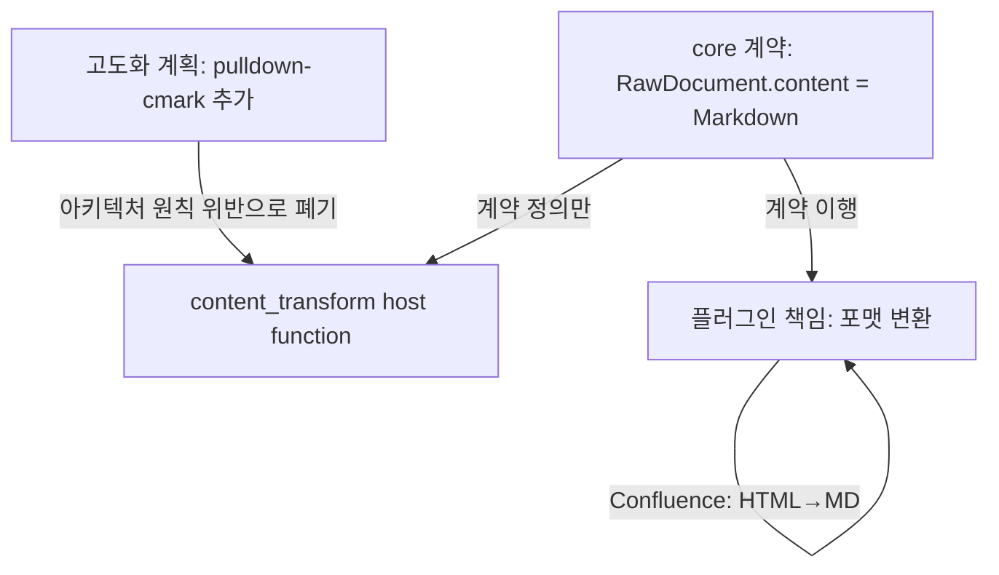

<!-- docsmith: auto-generated 2026-04-11 -->

# content_transform host function 고도화 폐기 — 포맷 변환은 플러그인 책임

이 문서는 `content_transform` host function에 `pulldown-cmark` 기반 마크다운 파서를 추가하는 계획을 검토하고 폐기한 아키텍처 결정을 기록한다. 소스 포맷 → 마크다운 변환 책임은 각 플러그인에 귀속된다는 원칙을 확정한다.

---

## 배경

`content_transform` host function 고도화 계획이 수립된 바 있다. 구체적으로는 core의 host function에 `pulldown-cmark`를 추가하여, WASM 플러그인이 호출할 수 있는 다목적 마크다운 변환기를 제공하는 방안이었다.

### 폐기된 계획 상세

- `content_transform` host function에 `pulldown-cmark` 크레이트 추가
- `mode` 파라미터 도입: `md_to_html`, `extract_code`, `headings`, `strip_html`
- 시그니처 변경: `WasmDocSourceAdapter::content_transform(raw: &str, mode: &str) -> String`

이 계획은 아키텍처 검토 과정에서 원칙 위반으로 판단되어 전면 폐기되었다.

---

## 결정

**`content_transform` host function에 마크다운 파서(pulldown-cmark)를 추가하지 않는다.**

`content_transform`의 현재 역할(HTML stripping + whitespace 정규화)은 변경 없이 유지한다. 소스 포맷 → 마크다운 변환은 각 플러그인이 직접 담당한다.

```
현재 상태 (변경 없음)
content_transform host function:
  - HTML stripping
  - whitespace 정규화
  (공유 유틸 수준)

플러그인 책임:
  - Confluence: HTML → Markdown  (crates/plugins/confluence/src/converter.rs)
  - GitHub:     이미 Markdown    → 통과
  - Obsidian:   이미 Markdown    → 통과
```

---

## 결정 이유

### 1. 아키텍처 원칙 위반

plugin-system.md의 핵심 원칙: "문서 소스가 뭐든, core의 검색 엔진은 하나." core의 host function은 플러그인에 시스템 수준 기능(HTTP, KV, 로그, 자격증명)을 제공하는 역할이다. 소스 포맷 변환은 플러그인 비즈니스 로직이며, host가 이를 알고 처리하는 구조는 core → plugin 방향의 의존성 역류다.

### 2. 책임 분리 명확화

`RawDocument.content`가 마크다운이어야 한다는 계약(인터페이스)은 core가 정의한다. 그러나 "어떤 소스 포맷을 마크다운으로 변환하는 방법"은 각 플러그인만 알 수 있는 도메인 지식이다.

```
core 책임:  RawDocument.content는 마크다운이어야 한다 (계약 정의)
플러그인 책임: 소스 포맷 → 마크다운 변환 (계약 이행)
```

### 3. WASM 바이너리 크기 최적화

고도화 계획대로 구현하면 core가 `pulldown-cmark`를 번들하고, 모든 WASM 플러그인이 이 host function에 의존하는 구조가 된다. 각 플러그인이 자신이 필요한 경량 변환 크레이트만 직접 번들하는 편이 의존성 그래프가 단순하고 바이너리 크기도 최적화된다.

### 4. 기존 테스트 breaking change 방지

`WasmDocSourceAdapter::content_transform` 시그니처 변경 시 기존 테스트 5개가 컴파일 실패한다. 현재 안정적으로 통과하고 있는 테스트를 불필요하게 깨뜨릴 이유가 없다.

---

## 대안 검토

| 대안 | 검토 결과 |
|------|----------|
| content_transform에 pulldown-cmark 추가 (원래 계획) | 아키텍처 원칙 위반 — 폐기 |
| content_transform을 mode 파라미터로 확장 | 동일 문제. host가 플러그인 도메인 지식을 가져야 함 |
| 공유 Rust 라이브러리 크레이트로 변환 유틸 추출 | 플러그인이 직접 의존 가능. 단, WASM 경계 내에서만 의미 있음 |
| 각 플러그인이 변환 로직 직접 구현 (채택) | 책임 분리 명확, 아키텍처 원칙 일치 |

---

## 향후 처리

- Confluence 플러그인 개선 시 `crates/plugins/confluence/src/converter.rs`에서 HTML → Markdown 변환 직접 구현
- `fetch_all`에 `expand=body.storage` 추가는 이미 완료 (커밋 `51f5cc3`)
- `content_transform` host function 현행 코드 변경 없음

---

## 영향 파일

변경 없음. 이 결정은 계획 폐기이므로 코드 변경이 발생하지 않는다.

참고:
- `crates/core/src/plugin/wasm_adapter.rs` — `content_transform` 현행 구현 유지
- `crates/plugins/confluence/src/` — 향후 converter.rs 추가 예정

---

## 결정 맥락



## 관련 문서

- [[doxus 1순위 구현 설계 결정 (sqlite-vec / WASM 브릿지 / mcp-server)]]
- [[doxus 플러그인 시스템 설계]]
- [[001-obsidian-nexus-계승-결정]]
