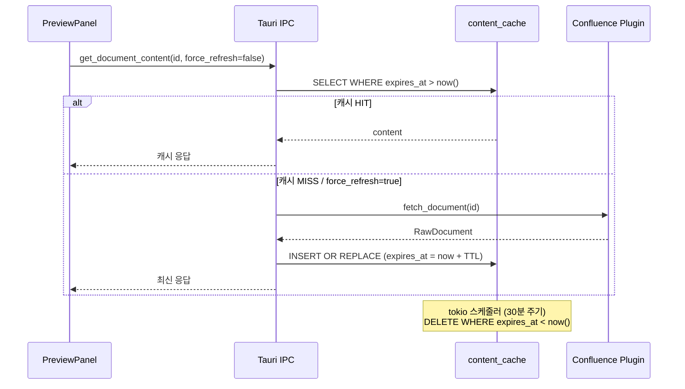

<!-- docsmith: auto-generated 2026-04-12 -->

# Confluence 콘텐츠 캐시 설계 — SQLite 기반 TTL 캐시 + tokio 스케줄러

이 문서는 doxus Confluence 플러그인의 문서 프리뷰 캐싱 전략에 관한 5가지 설계 결정을 기록한다. 캐시 저장소 선택, 만료 정리 방식, TTL 기본값, 설정 위치, 새로고침 버튼 범위에 대한 결정과 그 근거를 포함한다.

---

## 배경

doxus Confluence 플러그인에서 문서 프리뷰를 열 때마다 Confluence API를 호출하는 구조였다. 사용자가 매일 앱을 켜두고 사용하는 패턴이라 동일 문서를 반복 조회할 때도 매번 API 요청이 발생하는 문제가 인식되었다.

부가적으로, 프리뷰 화면에 새로고침 버튼이 없어 캐시가 도입된 이후에도 최신 내용을 강제로 가져올 방법이 없다는 UX 문제도 함께 확인되었다.

이 ADR은 해당 문제를 해결하기 위해 검토한 설계 옵션과 채택된 결정을 기록한다.

---

## 결정 1: 캐시 저장소 — SQLite `content_cache` 테이블

### 결정

별도 파일시스템 디렉터리나 인메모리 구조 대신, **기존 `~/.doxus/db/nexus.db`에 `content_cache` 테이블을 추가**하여 캐시를 저장한다.

### 스키마

V9 마이그레이션으로 추가:

```sql
-- V9__add_content_cache.sql
CREATE TABLE IF NOT EXISTS content_cache (
    source_doc_id  TEXT NOT NULL,
    plugin_id      TEXT NOT NULL,
    title          TEXT NOT NULL,
    content        TEXT NOT NULL,
    expires_at     INTEGER NOT NULL,   -- Unix timestamp (초)
    PRIMARY KEY (source_doc_id, plugin_id)
);

ALTER TABLE source_instances ADD COLUMN cache_ttl_minutes INTEGER;
-- NULL = 캐시 비활성화 (기본값)
```

### 검토한 대안

| 대안 | 검토 결과 |
|------|----------|
| 파일시스템 (`~/.doxus/cache/`) | OS 자동 정리 없음. TTL 직접 관리 필요. 파일 수 무한 증가 우려. 별도 디렉터리 관리 비용 발생. |
| 인메모리 `HashMap` | 앱 재시작 시 캐시 초기화. 매일 켜두는 패턴에서 재시작 후 cold 요청 급증. 메모리 상한 관리 필요. |
| SQLite `content_cache` (채택) | 기존 DB 인프라 재활용. `expires_at` 컬럼으로 TTL 쿼리 가능. 추가 파일/서버 불필요. 앱 재시작 후에도 유효 캐시 재사용. |

### 트레이드오프

- **장점**: 인프라 추가 없음, TTL 기반 일괄 삭제 쿼리가 단순 (`DELETE WHERE expires_at < now()`), 트랜잭션 보장
- **단점**: DB 파일 크기 증가 (문서 본문 저장). 대용량 문서가 많을 경우 `content_cache` 크기 모니터링 필요.

---

## 결정 2: 캐시 만료 정리 방식 — tokio 스케줄러 (30분 주기) + 앱 시작 즉시 정리

### 결정

**앱 시작 시 `cleanup_expired()` 1회 즉시 실행** + **`tokio::time::interval`로 30분마다 반복 정리**를 조합한다.

```rust
// crates/core/src/cache/mod.rs (개략)
pub async fn start_cleanup_scheduler(db: Arc<Db>) {
    let mut interval = tokio::time::interval(Duration::from_secs(1800));
    loop {
        interval.tick().await;
        db.cleanup_expired_cache().await.ok();
    }
}
```

앱 초기화 시:
```rust
db.cleanup_expired_cache().await?;           // 즉시 1회
tokio::spawn(start_cleanup_scheduler(db));   // 백그라운드 스케줄러 시작
```

### 검토한 대안

| 대안 | 검토 결과 |
|------|----------|
| 앱 시작/종료 시만 정리 | 매일 켜두는 패턴에서 TTL 30분 보장 불가. 12시간 가동 시 만료 캐시 무기한 누적. |
| 읽기 시 lazy 삭제만 | 읽지 않는 문서의 만료 캐시는 영구적으로 잔존. DB 크기 통제 불가. |
| 별도 OS 크론 | 추가 설치/설정 필요. doxus 외부 의존. 사용자에게 보이지 않는 작업이 시스템에 등록됨. |
| tokio 스케줄러 + 앱 시작 즉시 정리 (채택) | tokio는 이미 앱 내에서 사용 중 (추가 의존성 없음). 두 조합으로 TTL 완전 커버. |

### 트레이드오프

- **장점**: 추가 의존성 없음. TTL이 짧아도 정리 보장. 앱 시작 직후 만료 캐시 즉시 제거.
- **단점**: 앱이 종료된 상태에서는 정리 불가 (앱 재시작 시 즉시 정리로 보완).

---

## 결정 3: TTL 기본값 — NULL (캐시 비활성화)

### 결정

`source_instances.cache_ttl_minutes`의 기본값은 **`NULL`**로 설정한다. `NULL`은 "캐시 없음"을 의미하며, 해당 플러그인 인스턴스는 매 요청마다 소스 API를 직접 호출한다.

```
cache_ttl_minutes = NULL     → 캐시 비활성화 (기존 동작 유지)
cache_ttl_minutes = 10~60   → TTL(분) 단위 캐시 활성화
```

### 결정 이유

- 캐싱은 옵트인(opt-in)이어야 한다. 새로 설치한 플러그인이 의도치 않게 캐싱되는 것을 방지한다.
- 설정 전까지는 기존 동작(매번 API 호출)을 그대로 유지하므로 하위 호환성을 깨지 않는다.
- Obsidian처럼 캐싱이 불필요하거나 역효과인 소스도 기본적으로 안전하게 동작한다.

### 트레이드오프

- **장점**: 안전한 기본값. 사용자가 명시적으로 활성화해야 하므로 의도치 않은 지연 반영 없음.
- **단점**: 사용자가 설정을 찾아 활성화해야 캐시 혜택을 누릴 수 있음. 온보딩 UX에서 안내 필요.

---

## 결정 4: TTL 설정 위치 — 플러그인별 마켓 설정 모달

### 결정

TTL 설정은 **MarketPage의 기존 `PluginSettingsModal`에 캐시 섹션을 추가**하여 플러그인별로 독립 관리한다.

UI 구성:
- 토글: "캐시 사용" (OFF 시 `NULL`, ON 시 슬라이더 값 저장)
- 슬라이더: 10분 ~ 60분 (기본 30분)
- 적용 범위: 해당 플러그인 인스턴스의 `source_instances.cache_ttl_minutes`에 저장

### 결정 이유

플러그인 유형에 따라 캐싱의 유의미성이 다르다:

| 소스 | 캐싱 필요성 | 비고 |
|------|-----------|------|
| Obsidian | 불필요 / 역효과 | 로컬 파일 직접 읽기. 캐시 시 파일 변경 즉시 반영 안 됨. |
| Confluence | 유의미 | 외부 API. 반복 조회 비용 높음. |
| GitHub | 유의미 | 외부 API. Rate limit 존재. |

전역 설정에서 캐시 여부를 결정하면 Obsidian에도 캐시가 적용될 위험이 있다. 플러그인별 모달로 분리하면 소스 특성에 맞는 TTL 설정이 가능하다 (Confluence 30분, GitHub 10분 등 차별화 가능).

### 트레이드오프

- **장점**: 소스 특성에 맞는 세밀한 제어. 기존 `PluginSettingsModal` 확장이므로 신규 페이지 불필요.
- **단점**: 설정 위치가 마켓 페이지에 있어 검색 페이지에서 바로 접근 불가.

---

## 결정 5: 새로고침 버튼 — 모든 플러그인 공통, `force_refresh` 파라미터

### 결정

새로고침 버튼을 **Confluence 전용이 아닌 모든 플러그인 공통 UI**로 구현한다. Tauri IPC 커맨드에 `force_refresh: bool` 파라미터를 추가하여 캐시 여부와 무관하게 강제 재조회를 지원한다.

```rust
// apps/desktop/src-tauri/src/commands/document.rs
#[tauri::command]
pub async fn get_document_content(
    state: tauri::State<'_, AppState>,
    source_doc_id: String,
    plugin_id: String,
    force_refresh: bool,    // 추가
) -> Result<DocumentContent, String> {
    if force_refresh {
        state.cache.invalidate(&source_doc_id, &plugin_id).await?;
    }
    // 캐시 조회 → 없으면 플러그인 fetch
    ...
}
```

동작 정의:

| 플러그인 | `force_refresh=true` 동작 |
|---------|--------------------------|
| Confluence | 캐시 무효화 + API 재호출 |
| GitHub | 캐시 무효화 + API 재호출 |
| Obsidian | 캐시 무관, 파일 재읽기 (항상 최신) |

### 결정 이유

- 프리뷰 최신화 니즈는 Confluence에만 국한되지 않는다. GitHub도 동일한 문제가 있고, Obsidian도 외부 에디터에서 파일이 수정된 경우 재읽기가 유의미하다.
- 공통 파라미터로 처리하면 플러그인 추가 시 별도 새로고침 로직을 구현하지 않아도 된다.
- `force_refresh=false`가 기본값이므로 기존 동작을 깨지 않는다.

### 트레이드오프

- **장점**: 플러그인 공통 인터페이스. 향후 플러그인 추가 시 자동 지원.
- **단점**: Obsidian처럼 캐시를 사용하지 않는 플러그인에서도 버튼이 노출됨 (무해하나 약간의 UI 노이즈).

---

## 구현 계획 요약

이 ADR의 결정은 미시작 상태이며, 아래 작업으로 구현된다.

| 작업 | 대상 파일 |
|------|---------|
| V9 마이그레이션 | `crates/core/src/db/migrations/V9__add_content_cache.sql` (신규) |
| 캐시 모듈 | `crates/core/src/cache/mod.rs` (신규) |
| tokio 스케줄러 | `crates/core/src/cache/scheduler.rs` |
| IPC 커맨드 수정 | `apps/desktop/src-tauri/src/commands/document.rs` |
| MarketPage TTL UI | `apps/desktop/src/pages/market/PluginSettingsModal.tsx` |
| SearchPage 새로고침 버튼 | `apps/desktop/src/pages/search/PreviewPanel.tsx` |
| AppState 초기화 | `apps/desktop/src-tauri/src/state.rs` |
| 통합 테스트 | `crates/core/tests/cache_ttl.rs` (신규) |

변경 파일 8개 (신규 3개 포함), DB 마이그레이션 1개.

---

## 설계 흐름



---

## 관련 문서

- [[doxus 1순위 구현 설계 결정 (sqlite-vec / WASM 브릿지 / mcp-server)]]
- [[content_transform host function 고도화 폐기 — 포맷 변환은 플러그인 책임]]
- [[doxus 플러그인 시스템 설계]]
