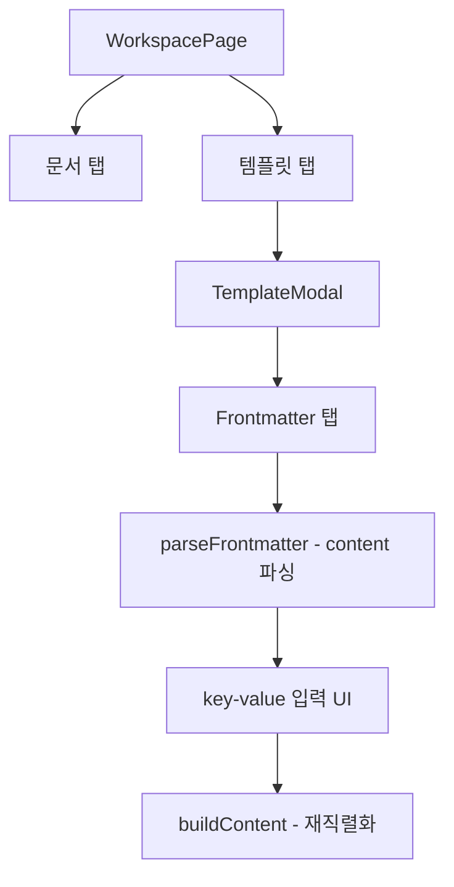

<!-- docsmith: auto-generated 2026-04-13 -->

# ADR-005: 워크스페이스 단일 공간 & frontmatter 파싱

두 가지 설계 결정을 기록한다: (1) 워크스페이스를 단일 공간으로 제한, (2) 별도 frontmatter_schema 컬럼 대신 content 파싱 방식 채택.

## 결정 1: 워크스페이스는 단일 공간

### 상태

채택 (Accepted)

### 배경

초기 구현에서 워크스페이스를 여러 개 생성/삭제할 수 있는 multi-workspace 구조로 설계했다. 워크스페이스 탭에서 목록 조회, 생성, 삭제가 가능했고, 관련 Tauri 커맨드(`list_workspaces`, `create_workspace`, `delete_workspace`)와 Zustand 스토어 액션이 구현되어 있었다.

### 결정

워크스페이스는 단 하나의 단일 공간이다. 앱 시작 시 디폴트 워크스페이스가 자동 생성되며, 추가 워크스페이스 생성은 지원하지 않는다.

### 근거

- doxus에서 워크스페이스의 역할은 "프로젝트 미지정 시 저장되는 메인 공간"으로, 복수 공간이 필요하지 않다
- 템플릿 관리 허브 역할 — 여러 워크스페이스가 생기면 템플릿 범위가 복잡해짐
- 복잡성 제거: 불필요한 CRUD 커맨드와 UI 분기 제거로 유지보수 부담 감소

### 변경 사항

| 영역 | 제거 항목 |
|------|----------|
| Tauri 커맨드 | `list_workspaces`, `create_workspace`, `delete_workspace` |
| Zustand 스토어 | `workspaces[]`, `fetchWorkspaces`, `createWorkspace`, `deleteWorkspace` |
| WorkspacePage UI | 워크스페이스 탭 제거 → 문서/템플릿 2탭만 유지 |

### 대안

**multi-workspace 유지**: 사용자가 워크스페이스를 프로젝트처럼 구분하는 사용 패턴을 지원할 수 있으나, doxus는 프로젝트(project) 단위로 이미 문서 범위를 구분하므로 중복이다.

---

## 결정 2: frontmatter_schema 별도 컬럼 제거

### 상태

채택 (Accepted)

### 배경

템플릿 구조화를 위해 `templates` 테이블에 `frontmatter_schema TEXT` 컬럼을 추가하는 계획이 있었다. JSON 배열로 필드 정의(`key`, `label`, `type`, `required`, `default`)를 저장하고, 이를 기반으로 구조화 입력 UI를 렌더링하려 했다.

### 결정

`frontmatter_schema` 컬럼을 추가하지 않는다. 대신 템플릿 content의 YAML frontmatter를 파싱해서 구조화 UI를 제공한다.

### 근거

- YAML frontmatter는 마크다운의 네이티브 메타데이터 형식으로, 별도 JSON 스키마는 중복된 표현이다
- `frontmatter_schema` 컬럼과 content frontmatter 두 개의 진실 소스가 생기면 불일치 발생 가능
- V16 마이그레이션이 불필요해져 위험 감소
- 단순한 구현: `parse_frontmatter()` 함수 하나로 content에서 직접 추출 가능

### 구현 방향

```
crates/core/src/document/frontmatter.rs
  ├── parse_frontmatter()    # content에서 YAML frontmatter 추출
  ├── build_document()       # frontmatter + body 조합
  └── fill_placeholders()    # 템플릿 변수 치환
```

프론트엔드에서도 동일 로직을 TypeScript로 구현:
- `parseFrontmatter()`: content 문자열에서 key-value 파싱
- `buildContent()`: 편집된 key-value를 다시 content로 직렬화
- TemplateModal Frontmatter 탭: 파싱된 key-value를 구조화 입력 UI로 표시

### 대안

**frontmatter_schema 컬럼 유지**: 스키마를 별도로 정의하면 타입 정보(`type: date`, `required: true` 등)를 명시할 수 있으나, YAML frontmatter 내에서도 타입을 규약으로 표현할 수 있으며, 두 소스 간 동기화 비용이 더 크다.

---

## 구조 개요



## 관련 문서

- [[doxus 아키텍처 원칙]]
- [[Frontend 규칙]]
- [[데이터베이스 규칙]]
