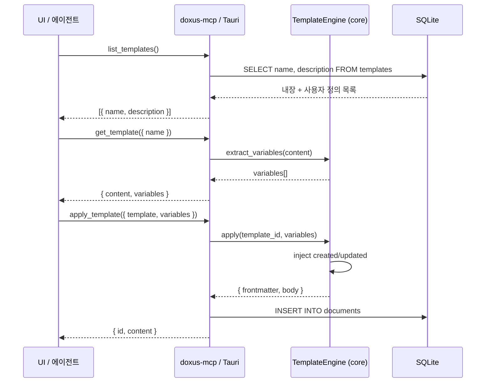

<!-- docsmith: auto-generated 2026-04-13 -->

# ADR-006: 템플릿 기반 문서 생성/수정/삭제 시스템 설계

UI(사람)와 MCP/CLI(AI 에이전트) 양쪽에서 문서를 생성할 때, 기존 이중 구조(빈 양식지 방식 vs Handlebars 치환 방식)를 Handlebars 기반 단일 템플릿 시스템으로 통일하는 결정을 기록한다.

## 상태

채택 (Accepted)

## 배경

doxus는 워크스페이스 문서를 관리하는 시스템이며, 사람(UI)과 AI 에이전트(MCP/CLI) 모두가 문서를 생성한다.

기존에 두 경로가 이중화되어 있었다.

- **UI 경로**: 빈 양식지 방식 — 템플릿을 선택하면 고정된 마크다운 본문을 그대로 에디터에 붙여넣음. 변수 치환 없음.
- **Rust 엔진(MCP) 경로**: Handlebars 변수 치환 방식 — `{{변수명}}` 문법으로 frontmatter와 본문을 생성.

두 방식이 공존하면서 동일 템플릿이 경로에 따라 다르게 렌더링되는 불일치가 발생했다. 특히 `created`, `updated` 같은 메타데이터 자동 주입이 UI 경로에서는 누락되는 문제가 있었다.

## 결정

모든 템플릿은 **Handlebars 단일 엔진**으로 처리한다. UI와 MCP 모두 `crates/core/src/workspace/template.rs`의 `TemplateEngine`을 재활용하며, 경로별 별도 구현을 제거한다.

## 설계 상세

### 템플릿 구조 (Handlebars 통일)

- 모든 템플릿은 `{{변수명}}` 문법 사용 (frontmatter + 본문 모두)
- 필수 frontmatter 5개: `title`, `aliases`, `created`, `updated`, `tags`
- `created` / `updated`는 서버가 오늘 날짜로 자동 주입 — 호출자가 전달 불필요
- 본문 섹션 헤딩은 implicit schema — 에이전트가 헤딩 의미로 내용을 추론

```handlebars
---
title: "{{title}}"
aliases:
  - {{title}}
tags:
  - {{tags}}
created: {{created}}
updated: {{updated}}
---

# {{title}}

## 배경

{{background}}

## 결정

{{decision}}
```

### 내장 템플릿 10종

| 이름 | 설명 |
|------|------|
| `note` | 일반 메모 |
| `meeting` | 회의록 |
| `decision` | 아키텍처 결정 기록 (ADR) |
| `devlog` | 개발 일지 |
| `retrospective` | 회고 |
| `weekly` | 주간 보고 |
| `study` | 학습 노트 |
| `library` | 참고 자료 정리 |
| `article` | 외부 아티클 요약 |
| `journal` | 일기/개인 기록 |

내장 템플릿은 바이너리에 번들되며, 사용자 정의 템플릿은 DB `templates` 테이블(V14 스키마)에 저장된다.

### 관점 1: AI 에이전트가 사용하는 방식

에이전트는 MCP 도구만으로 템플릿을 발견하고 문서를 생성한다. 에이전트가 사전에 알아야 할 정보는 없다.

#### 전체 흐름

```
Step 1: 어떤 템플릿이 있는지 파악
doxus_list_templates()
→ [
    { name: "meeting",  description: "회의록" },
    { name: "decision", description: "아키텍처 결정 기록" },
    { name: "devlog",   description: "개발 일지" },
    ...
  ]
  ※ content 미포함 — 불필요한 토큰 낭비 방지

Step 2: 선택한 템플릿의 변수 파악
doxus_get_template({ name: "meeting" })
→ {
    content: "---\ntitle: {{title}}\ndate: {{date}}\n...",
    variables: ["title", "date", "attendees", "agenda", "decisions"]
  }
  ※ variables는 Handlebars AST에서 자동 추출 — 에이전트가 섹션 헤딩으로 의미 추론

Step 3: 변수를 채워 문서 생성
doxus_apply_template({
  template: "meeting",
  variables: {
    title: "4월 3주차 스프린트 회의",
    date: "2026-04-13",
    attendees: "김철수, 이영희",
    agenda: "- 지난 스프린트 리뷰\n- 이번 스프린트 계획",
    decisions: "Feature X 우선 진행"
  }
})
→ {
    id: 42,
    content: "---\ntitle: 4월 3주차 스프린트 회의\ncreated: 2026-04-13\n...",
    frontmatter: { title: "...", date: "...", created: "2026-04-13", ... },
    body: "# 4월 3주차 스프린트 회의\n\n## 참석자\n..."
  }
  ※ created/updated는 서버 자동 주입 — 에이전트가 전달 불필요
  ※ frontmatter가 파싱되어 별도로 제공 — 에이전트가 직접 파싱 불필요

Step 4 (선택): 내용 수정
doxus_update_document({ id: 42, content: "수정된 전체 마크다운" })

Step 5 (선택): 삭제
doxus_delete_document({ id: 42 })
```

#### 에이전트 친화적 설계 포인트

| 고려사항 | 설계 결정 |
|----------|-----------|
| 어떤 템플릿이 있는지 | `list_templates`로 발견 가능 (사전 지식 불필요) |
| 어떤 변수를 채워야 하는지 | `get_template`의 `variables` 배열로 파악 |
| 변수 의미는 어떻게 아는지 | 변수명 + 섹션 헤딩이 implicit schema (LLM 추론) |
| 날짜/메타데이터 자동화 | `created/updated` 서버 자동 주입 |
| 응답에서 frontmatter 파싱 | `frontmatter` 객체로 분리 제공 |
| 토큰 효율 | `list_templates`는 content 없이 이름+설명만 반환 |

---

### 관점 2: 사람(UI)이 사용하는 방식

사람은 데스크톱 앱에서 템플릿을 선택하고, 시스템이 자동으로 입력 폼을 생성해준다.

#### 전체 흐름

```
1. 워크스페이스 → 템플릿 탭
   → 내장 10종 + 사용자 정의 템플릿 목록 표시

2. 템플릿 카드 클릭 (예: 회의록)
   → 내부적으로 get_template("meeting") 호출
   → variables: ["title", "date", "attendees", "agenda", "decisions"] 수신

3. 입력 폼 자동 생성
   [제목        ] ← title (필수)
   [날짜        ] ← date  (날짜 picker)
   [참석자      ] ← attendees
   [안건        ] ← agenda (멀티라인)
   [결정 사항   ] ← decisions (멀티라인)
   ※ created/updated는 폼에 표시 안 함 (서버 자동 주입)

4. "생성" 버튼
   → apply_template_cmd("meeting", { title, date, attendees, ... })
   → 서버에서 Handlebars 렌더링 + frontmatter 파싱

5. 에디터에 열림
   → frontmatter 편집 영역 + 본문 에디터
```

#### 사람 친화적 설계 포인트

| 고려사항 | 설계 결정 |
|----------|-----------|
| 새 템플릿 추가 시 UI 수정 불필요 | variables 기반 폼 자동 생성 |
| created/updated 수동 입력 불필요 | 서버 자동 주입, UI에서 숨김 |
| 커스텀 템플릿도 동일하게 동작 | DB 템플릿도 Handlebars 형식 |
| 미리보기 | apply 전에 로컬 렌더링 표시 가능 |

---

### MCP 도구 요약

```
doxus_list_templates()              → [{ name, description }]
doxus_get_template({ name })        → { content, variables }
doxus_apply_template({ template, variables }) → { id, content, frontmatter, body }
doxus_update_document({ id, content })        → 수정
doxus_delete_document({ id })                 → 삭제
```

### Tauri IPC 커맨드

| 커맨드 | 설명 |
|--------|------|
| `apply_template_cmd(template_id, variables)` | 템플릿 적용 — MCP와 동일 core 로직 재활용 |
| `list_templates_cmd()` | 내장 + DB 템플릿 합산 목록 반환 |

```rust
#[tauri::command]
pub async fn apply_template_cmd(
    state: tauri::State<'_, AppState>,
    template_id: String,
    variables: HashMap<String, String>,
) -> Result<AppliedTemplate, String> {
    state.template_engine
        .apply(&template_id, &variables)
        .await
        .map_err(|e| e.to_string())
}
```

### variables 추출 방식

Handlebars AST 파싱으로 `{{변수명}}`을 자동 추출한다. 정규식 기반이 아님.

```rust
// crates/core/src/workspace/template.rs
pub fn extract_variables(content: &str) -> Vec<String> {
    // handlebars-rust의 AST를 순회하여 Parameter::Name 수집
    // 시스템 주입 변수(created, updated)는 결과에서 제외
}
```

`doxus_get_template` 응답의 `variables` 배열은 이 함수의 출력을 그대로 사용한다.

### 문서 수정 / 삭제

| 작업 | 도구 | 범위 |
|------|------|------|
| 전체 교체 | `doxus_update_document({ id, content })` | 현재 구현됨 |
| 부분 교체 | `doxus_update_section` | 추후 구현 (현재 범위 외) |
| 삭제 | `doxus_delete_document({ id })` | 현재 구현됨 |

### 사용자 정의 템플릿 (V14 스키마)

```sql
CREATE TABLE IF NOT EXISTS templates (
    id          INTEGER PRIMARY KEY AUTOINCREMENT,
    name        TEXT NOT NULL UNIQUE,
    description TEXT,
    content     TEXT NOT NULL,   -- Handlebars 형식 마크다운
    is_builtin  INTEGER NOT NULL DEFAULT 0,
    created_at  INTEGER NOT NULL,
    updated_at  INTEGER NOT NULL
);
```

- 내장 템플릿(`is_builtin = 1`)과 동일한 Handlebars 형식
- `doxus_list_templates`에서 내장 + DB 템플릿 합산 반환
- 내장 템플릿 이름 충돌 시 DB 템플릿 우선

## 근거

### "구조가 schema다"

Linear, GitHub Issues, Obsidian Templater를 조사한 결과, 별도 타입 선언 없이 **마크다운 구조(섹션 헤딩) 자체를 스펙으로** 삼는 방식이 에이전트 친화적임을 확인했다.

- **Linear**: 구조화된 필드 자체가 AI semantic anchor
- **GitHub Issues**: 섹션 헤딩이 implicit schema
- **Obsidian Templater**: `{{}}` 변수 치환 방식

`frontmatter_schema` 같은 별도 메타스키마를 두지 않는다. AST로 추출한 `variables` 배열이 충분한 계약이다. (ADR-005 참조)

### UI / MCP 경로 통일의 이점

- 단일 진실 소스: `TemplateEngine` 하나
- `created` / `updated` 자동 주입이 양쪽 경로 모두에서 보장됨
- UI에서 variables 폼 자동 생성이 가능해져 새 템플릿 추가 시 UI 코드 변경 불필요

## 대안

### 대안 1: 경로별 별도 구현 유지

UI는 빈 양식지, MCP는 Handlebars를 계속 유지. 간단하지만 `created/updated` 불일치, 코드 중복, 신규 템플릿 추가 시 양쪽 모두 수정 필요라는 문제가 지속된다.

### 대안 2: JSON Schema 기반 구조화 폼

`frontmatter_schema` 컬럼에 JSON 배열로 필드 정의를 저장하고, 이를 기반으로 입력 UI를 렌더링. 타입 정보(`type: date`, `required: true`)를 명시할 수 있으나, content frontmatter와 이중 진실 소스가 생겨 동기화 비용이 크다. ADR-005에서 이미 기각한 방향이다.

### 대안 3: 정규식 기반 variables 추출

구현이 단순하지만, 주석 처리된 `{{변수}}`, partial 내부 변수, `{{#if}}` 블록 변수를 올바르게 처리하지 못한다. AST 파싱으로 대체한다.

## 구현 범위

| 파일 | 변경 내용 |
|------|----------|
| `crates/core/src/workspace/template.rs` | `TemplateEngine` 확장 — `extract_variables`, `apply` |
| `crates/mcp-server/src/lib.rs` | `doxus_list_templates`, `doxus_get_template`, `doxus_apply_template` 도구 추가 |
| `apps/desktop/src-tauri/src/commands/workspace.rs` | `apply_template_cmd`, `list_templates_cmd` Tauri 커맨드 추가 |
| `apps/desktop/src/pages/WorkspacePage.tsx` | variables 배열 기반 입력 폼 자동 생성 UI |

## 흐름 다이어그램



## 관련 문서

- [[ADR-005: 워크스페이스 단일 공간 & frontmatter 파싱]]
- [[ADR-003: content-transform 플러그인 책임 분리]]
- [[에이전트 & MCP 규칙]]
- [[Frontend 규칙 (Tauri v2 + React 19)]]
- [[데이터베이스 규칙]]
