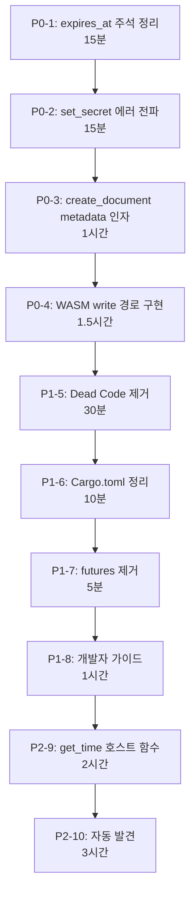

# Phase 3 코드 리뷰 개선 계획 (통합)

> **작성일**: 2026-04-15  
> **리뷰어**: Claude Opus 4.6  
> **실행자**: Gemini 3 Flash  
> **대상**: Confluence WASM 마이그레이션 (Phase 3), 플러그인 시스템, 문서 생성 기능

---

## 목차

1. [P0: 머지 전 필수 수정 (4건)](#p0--머지-전-필수-수정)
2. [P1: 구조 개선 (4건)](#p1--구조-개선)
3. [P2: 후속 작업 (2건)](#p2--후속-작업)
4. [작업 순서](#작업-순서)

---

## P0 — 머지 전 필수 수정

### 1. `expires_at`에 상대 시간(`expires_in`)이 그대로 저장되는 버그

**파일**: [`crates/plugins/confluence/src/lib.rs`](file:///Users/madup/gorillaProject/doxus/crates/plugins/confluence/src/lib.rs)  
**위치**: 338번 줄  
**예상 소요**: 30분

**현재 코드 (버그)**:
```rust
// lib.rs:338
state.expires_at = Some(token_resp.expires_in);
```

**문제**: `expires_in`은 상대 시간(초 단위, 예: `3600`)이지만, `expires_at`은 절대 타임스탬프(Unix epoch)여야 함. 
현재는 `ensure_valid_token`의 `now`가 `0`으로 하드코딩되어 우연히 동작하지만, `get_time` 호스트 함수 도입 시 만료 판단이 오동작함.

**수정 방안**: `get_time` 호스트 함수가 도입되기 전까지 임시 처리.
`expires_in`을 그대로 저장하되, 주석으로 절대 시각 전환 필요성을 명시:

```rust
// lib.rs:338 수정
// TODO: get_time 호스트 함수 도입 후 `now + expires_in`으로 절대 시각 저장
// 현재는 now=0 기반이므로 expires_in을 그대로 저장해도 일관성 유지됨
state.expires_at = Some(token_resp.expires_in);
```

**검증**: 기존 `wasm_confluence_refresh_test` 재실행하여 통과 확인.

---

### 2. `__doxus_set_secret` 에러가 무시됨

**파일**: [`crates/plugins/confluence/src/lib.rs`](file:///Users/madup/gorillaProject/doxus/crates/plugins/confluence/src/lib.rs)  
**위치**: 342-347번 줄  
**예상 소요**: 15분

**현재 코드 (문제)**:
```rust
// lib.rs:342-347
unsafe {
    let _ = __doxus_set_secret("access_token".to_string(), state.access_token.clone().unwrap());
    if let Some(rt) = &state.refresh_token {
        let _ = __doxus_set_secret("refresh_token".to_string(), rt.clone());
    }
    let _ = __doxus_set_secret("expires_at".to_string(), state.expires_at.unwrap().to_string());
}
```

**문제**: `let _ =` 패턴으로 호스트 함수 호출 결과를 무시하고 있음. 토큰 갱신 성공 → 키체인 저장 실패 시, 다음 세션에서 이전(만료된) 토큰을 사용하게 돼 사용자가 원인을 알 수 없음.

**수정 코드**:
```rust
// lib.rs:342-347 수정 — let _ 를 ? 로 변경
unsafe {
    __doxus_set_secret("access_token".to_string(), state.access_token.clone().unwrap())?;
    if let Some(rt) = &state.refresh_token {
        __doxus_set_secret("refresh_token".to_string(), rt.clone())?;
    }
    __doxus_set_secret("expires_at".to_string(), state.expires_at.unwrap().to_string())?;
}
```

**주의**: `__doxus_set_secret`의 반환 타입이 `FnResult<()>`인지 확인 필요.  
호스트 함수 선언 위치: `lib.rs:15-18`:
```rust
#[host_fn]
extern "ExtismHost" {
    fn __doxus_set_secret(key: String, value: String);
}
```
`extism-pdk`의 `#[host_fn]` 매크로가 `-> Result<(), Error>`를 반환하므로 `?` 전파 가능.

**검증**: WASM 재빌드 후 `wasm_confluence_refresh_test` 재실행.
```bash
cargo build -p doxus-plugin-confluence --target wasm32-unknown-unknown
cargo test --test wasm_confluence_refresh_test -- --nocapture
```

---

### 3. `create_document`에 metadata 인자 추가

**파일 목록** (총 4개 파일 수정):
1. [`crates/plugin-sdk/src/lib.rs`](file:///Users/madup/gorillaProject/doxus/crates/plugin-sdk/src/lib.rs) — 트레이트 정의
2. [`crates/plugins/obsidian/src/lib.rs`](file:///Users/madup/gorillaProject/doxus/crates/plugins/obsidian/src/lib.rs) — Obsidian 구현체
3. [`crates/mcp-server/src/tools/workspace.rs`](file:///Users/madup/gorillaProject/doxus/crates/mcp-server/src/tools/workspace.rs) — MCP 엔드포인트
4. [`crates/mcp-server/tests/write_back_integration_test.rs`](file:///Users/madup/gorillaProject/doxus/crates/mcp-server/tests/write_back_integration_test.rs) — 테스트

**예상 소요**: 1시간

#### 3-1. 트레이트 시그니처 변경

**파일**: `crates/plugin-sdk/src/lib.rs`  
**위치**: 294-303번 줄

**현재**:
```rust
// lib.rs:294-303
async fn create_document(
    &self,
    _title: &str,
    _content: &str,
) -> Result<SourceDocId, PluginError> {
    Err(PluginError::Internal(
        "create_document not supported by this plugin".to_string(),
    ))
}
```

**변경**:
```rust
async fn create_document(
    &self,
    _title: &str,
    _content: &str,
    _metadata: Option<&HashMap<String, serde_json::Value>>,
) -> Result<SourceDocId, PluginError> {
    Err(PluginError::Internal(
        "create_document not supported by this plugin".to_string(),
    ))
}
```

#### 3-2. Obsidian 구현체 수정

**파일**: `crates/plugins/obsidian/src/lib.rs`  
**위치**: 441-458번 줄

**현재**:
```rust
// obsidian/lib.rs:441-458
async fn create_document(
    &self,
    title: &str,
    content: &str,
) -> Result<SourceDocId, PluginError> {
    let vault = self.vault()?;
    let safe_title = title.replace(|c: char| !c.is_alphanumeric() && c != ' ' && c != '-' && c != '_', "");
    let filename = format!("{}.md", safe_title.trim());
    let path = vault.join(&filename);

    if path.exists() {
        return Err(PluginError::Internal(format!("file already exists: {}", filename)));
    }

    std::fs::write(&path, content).map_err(|e| PluginError::Internal(e.to_string()))?;

    Ok(SourceDocId(filename))
}
```

**변경**: metadata가 있으면 YAML frontmatter로 변환하여 content 앞에 삽입:
```rust
async fn create_document(
    &self,
    title: &str,
    content: &str,
    metadata: Option<&HashMap<String, serde_json::Value>>,
) -> Result<SourceDocId, PluginError> {
    let vault = self.vault()?;
    let safe_title = title.replace(|c: char| !c.is_alphanumeric() && c != ' ' && c != '-' && c != '_', "");
    let filename = format!("{}.md", safe_title.trim());
    let path = vault.join(&filename);

    if path.exists() {
        return Err(PluginError::Internal(format!("file already exists: {}", filename)));
    }

    // metadata가 있으면 YAML frontmatter로 변환
    let final_content = if let Some(meta) = metadata {
        let mut fm_lines = Vec::new();
        for (key, val) in meta {
            let val_str = match val {
                serde_json::Value::String(s) => s.clone(),
                serde_json::Value::Array(arr) => {
                    let items: Vec<String> = arr.iter()
                        .map(|v| v.as_str().map(|s| s.to_string()).unwrap_or_else(|| v.to_string()))
                        .collect();
                    format!("\n  - {}", items.join("\n  - "))
                }
                _ => val.to_string(),
            };
            fm_lines.push(format!("{}: {}", key, val_str));
        }
        format!("---\n{}\n---\n{}", fm_lines.join("\n"), content)
    } else {
        content.to_string()
    };

    std::fs::write(&path, final_content).map_err(|e| PluginError::Internal(e.to_string()))?;

    Ok(SourceDocId(filename))
}
```

#### 3-3. MCP 엔드포인트 수정

**파일**: `crates/mcp-server/src/tools/workspace.rs`

**`create_document` (85-127번 줄)**: `args["metadata"]`를 파싱하여 전달:
```rust
// workspace.rs:85 수정
pub async fn create_document(server: &McpServer, id: Value, args: &Value) -> McpResponse {
    let title = match args["title"].as_str() {
        Some(t) => t,
        None => return McpResponse::err(id, -32602, "missing required arg: title"),
    };
    let project_name = args["project"].as_str();

    let (project_id, source) = match resolve_write_source(server, project_name).await {
        Ok(res) => res,
        Err(e) => return McpResponse::err(id, -32603, e),
    };

    let doc_type = args["doc_type"].as_str().unwrap_or("note");
    let content = format!("# {title}\n\n");

    // metadata 파싱
    let mut metadata_map = std::collections::HashMap::new();
    if let Some(obj) = args["metadata"].as_object() {
        for (k, v) in obj {
            metadata_map.insert(k.clone(), v.clone());
        }
    }
    // doc_type도 metadata에 포함
    metadata_map.entry("doc_type".to_string()).or_insert(json!(doc_type));
    let metadata_opt = if metadata_map.is_empty() { None } else { Some(&metadata_map) };

    match source.create_document(title, &content, metadata_opt).await {
        // ... 나머지 동일
    }
}
```

**`apply_template` (287번 줄)**: 동일하게 `metadata` 인자 추가. 템플릿 변수에서 metadata 추출:
```rust
// workspace.rs:287
match source.create_document(&title, &content, None).await {
```

#### 3-4. 테스트 수정

**파일**: `crates/mcp-server/tests/write_back_integration_test.rs:39`

Mock 구현의 시그니처 변경:
```rust
async fn create_document(&self, _title: &str, _content: &str, _metadata: Option<&HashMap<String, serde_json::Value>>) -> Result<SourceDocId, PluginError> {
```

**파일**: `crates/plugins/obsidian/src/lib.rs:1016-1042` (Obsidian 테스트):
```rust
// 기존
let id = plugin.create_document("New Note", "# New Note\nBody content").await.unwrap();
// 변경
let id = plugin.create_document("New Note", "# New Note\nBody content", None).await.unwrap();
```

**검증**:
```bash
cargo test --workspace
```

---

### 4. `WasmDocSourceAdapter`에 write 경로 구현

**파일 목록** (총 2개 파일):
1. [`crates/plugin-sdk/src/wasm_types.rs`](file:///Users/madup/gorillaProject/doxus/crates/plugin-sdk/src/wasm_types.rs) — WASM 공유 타입 추가
2. [`crates/core/src/plugin/wasm_adapter.rs`](file:///Users/madup/gorillaProject/doxus/crates/core/src/plugin/wasm_adapter.rs) — DocSource impl 확장

**예상 소요**: 1.5시간

#### 4-1. wasm_types.rs에 write 관련 타입 추가

**파일**: `crates/plugin-sdk/src/wasm_types.rs`  
**위치**: 파일 끝(47번 줄 이후)에 추가

```rust
// wasm_types.rs 끝에 추가

#[derive(Serialize, Deserialize, Debug)]
pub struct CreateDocumentOptsWasm {
    pub title: String,
    pub content: String,
    pub metadata: HashMap<String, serde_json::Value>,
}

#[derive(Serialize, Deserialize, Debug)]
pub struct CreateDocumentResultWasm {
    pub id: String,
}

#[derive(Serialize, Deserialize, Debug)]
pub struct UpdateDocumentOptsWasm {
    pub id: String,
    pub content: Option<String>,
    pub metadata: Option<HashMap<String, serde_json::Value>>,
}

#[derive(Serialize, Deserialize, Debug)]
pub struct DeleteDocumentOptsWasm {
    pub id: String,
}
```

#### 4-2. WasmDocSourceAdapter의 DocSource impl 확장

**파일**: `crates/core/src/plugin/wasm_adapter.rs`  
**위치**: 629번 줄 (`}` — `impl DocSource for WasmDocSourceAdapter` 블록 종료) 직전에 추가

현재 `impl DocSource` 블록은 `fetch_changes`가 마지막 메서드(614-628번 줄)이고, 629번 줄에서 `}` 로 닫힘.

629번 줄의 `}` **직전**에 다음 메서드들을 추가:

```rust
    fn supports_write(&self) -> bool {
        // WASM 플러그인이 create_document 함수를 내보내는지 확인
        // Plugin::has_function()이 없으면 false 반환
        let guard = self.plugin.lock().ok();
        guard.map_or(false, |g| g.function_exists("create_document"))
    }

    async fn create_document(
        &self,
        title: &str,
        content: &str,
        metadata: Option<&HashMap<String, serde_json::Value>>,
    ) -> Result<SourceDocId, PluginError> {
        use doxus_plugin_sdk::wasm_types::{CreateDocumentOptsWasm, CreateDocumentResultWasm};

        let opts = CreateDocumentOptsWasm {
            title: title.to_string(),
            content: content.to_string(),
            metadata: metadata.cloned().unwrap_or_default(),
        };
        let result: CreateDocumentResultWasm = self.call_wasm("create_document", &opts).await?;
        Ok(SourceDocId(result.id))
    }

    async fn update_document(
        &self,
        id: &SourceDocId,
        content: Option<&str>,
        metadata: Option<&HashMap<String, serde_json::Value>>,
    ) -> Result<(), PluginError> {
        use doxus_plugin_sdk::wasm_types::UpdateDocumentOptsWasm;

        let opts = UpdateDocumentOptsWasm {
            id: id.0.clone(),
            content: content.map(|s| s.to_string()),
            metadata: metadata.cloned(),
        };
        self.call_wasm::<UpdateDocumentOptsWasm, ()>("update_document", &opts).await
    }

    async fn delete_document(&self, id: &SourceDocId) -> Result<(), PluginError> {
        use doxus_plugin_sdk::wasm_types::DeleteDocumentOptsWasm;

        let opts = DeleteDocumentOptsWasm { id: id.0.clone() };
        self.call_wasm::<DeleteDocumentOptsWasm, ()>("delete_document", &opts).await
    }
```

**주의 사항**:
- `Plugin::function_exists()` 메서드가 Extism 1.x SDK에 있는지 확인 필요. 없으면 대안:
  ```rust
  fn supports_write(&self) -> bool {
      // 대안: manifest에 supports_write 필드 추가
      // 또는 항상 false → 개별 WASM 플러그인이 오버라이드하는 구조
      false
  }
  ```
- `metadata: Option<&HashMap<...>>`의 `&`는 `call_wasm`에서 `Serialize`가 필요하므로 `.cloned()` 처리

**검증**:
```bash
cargo test --workspace
```

---

## P1 — 구조 개선

### 5. Dead Code: `extism_http_request` 호스트 함수 제거

**파일**: [`crates/core/src/plugin/wasm_adapter.rs`](file:///Users/madup/gorillaProject/doxus/crates/core/src/plugin/wasm_adapter.rs)  
**위치**: 159-224번 줄 (http_req_fn 정의 블록 전체)  
**예상 소요**: 30분

**배경**: `Manifest::with_allowed_host()`를 설정하면 Extism 런타임이 내장 HTTP를 제공하므로 `extism_pdk::http::request()`가 직접 동작함. 직접 등록한 `extism_http_request` 호스트 함수는 PDK가 호출하지 않아 Dead Code.

**삭제 대상**:
1. **159-164번 줄**: `allowed_domains_inner`, `http_client_inner` 변수 (호스트 함수 클로저 전용)
2. **168-224번 줄**: `http_req_fn` (`Function::new("extism_http_request", ...)` 블록 전체)
3. **245번 줄**: `Plugin::new()` 호출에서 `http_req_fn` 제거:
   ```rust
   // 현재
   let plugin = Plugin::new(&extism_manifest, [http_req_fn, set_secret_fn], true)
   // 변경
   let plugin = Plugin::new(&extism_manifest, [set_secret_fn], true)
   ```
4. **248-252번 줄**: 중복 `allowed_domains`, `http_client` 변수 — 이미 `self.allowed_domains`, `self.http_client`로 별도 존재하므로 확인 후 정리

**주의**: `HttpRequest`, `HttpResponse` 구조체(33-48번 줄)는 `self.http_request()` 메서드(405번 줄)에서 사용할 수 있으므로 사용 여부를 `grep`으로 확인 후 판단:
```bash
grep -n "HttpRequest\|HttpResponse" crates/core/src/plugin/wasm_adapter.rs
```

**검증**: 
```bash
cargo build -p doxus-plugin-confluence --target wasm32-unknown-unknown
cargo test --test wasm_confluence_refresh_test -- --nocapture
```

---

### 6. 워크스페이스 `members` + `exclude` 중복 정리

**파일**: [`Cargo.toml`](file:///Users/madup/gorillaProject/doxus/Cargo.toml) (워크스페이스 루트)  
**위치**: 3-19번 줄  
**예상 소요**: 10분

**현재** (의도 불명확):
```toml
members = [
    "crates/core",
    "crates/plugin-sdk",
    "crates/plugins/obsidian",
    "crates/cli",
    "crates/mcp-server",
    "crates/agent",
    "crates/extism-poc",
    "crates/plugins/confluence",   # ← members에 포함
    "crates/plugins/github",       # ← members에 포함
    "apps/desktop/src-tauri",
]

exclude = [
    "crates/plugins/confluence",   # ← exclude에서 다시 제외
    "crates/plugins/github",       # ← exclude에서 다시 제외
]
```

**변경**: `members`에서 WASM 전용 플러그인 제거, `exclude` 블록 삭제:
```toml
members = [
    "crates/core",
    "crates/plugin-sdk",
    "crates/plugins/obsidian",
    "crates/cli",
    "crates/mcp-server",
    "crates/agent",
    "crates/extism-poc",
    # WASM 플러그인은 별도 빌드: cargo build --target wasm32-unknown-unknown
    "apps/desktop/src-tauri",
]
```

**검증**: `cargo test --workspace`

---

### 7. 미사용 `futures` dev-dependency 제거

**파일**: [`crates/core/Cargo.toml`](file:///Users/madup/gorillaProject/doxus/crates/core/Cargo.toml)  
**위치**: 65번 줄  
**예상 소요**: 5분

**삭제**:
```diff
-futures = "0.3"
```

**검증**: `cargo test --test wasm_confluence_refresh_test`

---

### 8. 플러그인 개발자 가이드 작성

**파일**: `docs/plugin-dev-guide.md` (새로 생성)  
**예상 소요**: 1시간

**포함 내용**:

1. **필수 내보내기 함수** (WASM 플러그인이 반드시 `#[plugin_fn]`으로 구현해야 하는 것):
   - `initialize(Json<InitOpts>) -> FnResult<()>` — 설정/시크릿 초기화
   - `fetch_all(Json<FetchAllOptsWasm>) -> FnResult<Json<DocumentStreamWasm>>` — 전체 문서 조회
   - `fetch_document(Json<FetchDocumentOptsWasm>) -> FnResult<Json<RawDocumentWasm>>` — 단건 조회
   - `health_check() -> FnResult<String>` — 헬스체크

2. **선택적 내보내기 함수**:
   - `fetch_changes(Json<FetchChangesOptsWasm>) -> FnResult<Json<ChangeSetWasm>>` — 증분 동기화
   - `create_document(Json<CreateDocumentOptsWasm>) -> FnResult<Json<CreateDocumentResultWasm>>` — 문서 생성
   - `update_document(Json<UpdateDocumentOptsWasm>) -> FnResult<()>` — 문서 수정
   - `delete_document(Json<DeleteDocumentOptsWasm>) -> FnResult<()>` — 문서 삭제

3. **Cargo.toml 템플릿** (Confluence 참고):
   ```toml
   [lib]
   crate-type = ["cdylib", "rlib"]

   [dependencies]
   doxus-plugin-sdk = { path = "../../plugin-sdk", default-features = false }
   extism-pdk = "1"
   serde = { version = "1", features = ["derive"] }
   serde_json = "1"
   ```

4. **manifest.json 스키마**:
   ```json
   {
     "plugin_id": "com.example.my-plugin",
     "display_name": "My Plugin",
     "version": "0.1.0",
     "abi_version": 1,
     "http_domains": ["api.example.com"],
     "kv_namespaces": [],
     "secrets": ["api_key"]
   }
   ```

5. **빌드 명령어**:
   ```bash
   cargo build --target wasm32-unknown-unknown --release
   ```

6. **호스트 함수 사용 가이드**:
   - `__doxus_set_secret(key, value)` — 시크릿 저장 (키체인에 영속)
   - `extism_pdk::http::request()` — HTTP 요청 (manifest의 `http_domains`에 선언된 도메인만 허용)
   - `extism_pdk::var::get/set` — 인스턴스 내 상태 관리 (비영속, 세션 범위)

---

## P2 — 후속 작업 (별도 이슈)

### 9. `get_time` 호스트 함수 구현

**예상 소요**: 2시간

**목적**: WASM 게스트가 시스템 시간에 접근할 수 없으므로, 호스트가 현재 시각을 제공하는 함수 필요.

**호스트 측 (wasm_adapter.rs)**: `from_bytes()` 내에 새 호스트 함수 등록:
```rust
let get_time_fn = Function::new(
    "__doxus_get_time",
    [],
    [ValType::I64],
    UserData::new(()),
    |_plugin: &mut CurrentPlugin, _inputs: &[Val], outputs: &mut [Val], _user_data: UserData<()>| {
        let now = std::time::SystemTime::now()
            .duration_since(std::time::UNIX_EPOCH)
            .unwrap_or_default()
            .as_secs() as i64;
        outputs[0] = Val::I64(now);
        Ok(())
    }
);

// Plugin::new() 호출에 추가
let plugin = Plugin::new(&extism_manifest, [set_secret_fn, get_time_fn], true)
```

**게스트 측 (confluence/src/lib.rs)**: 호스트 함수 선언 및 사용:
```rust
// lib.rs:15-18에 추가
#[host_fn]
extern "ExtismHost" {
    fn __doxus_set_secret(key: String, value: String);
    fn __doxus_get_time() -> i64;
}

// lib.rs:287 수정
fn ensure_valid_token(state: &mut PluginState) -> FnResult<()> {
    let now: i64 = unsafe { __doxus_get_time()? };
    // ... 나머지 동일
}

// lib.rs:338 수정
state.expires_at = Some(now + token_resp.expires_in);
// (now는 refresh_oauth_token 안에서도 __doxus_get_time()으로 가져와야 함)
```

**검증**: WASM 재빌드 후 통합 테스트 실행.

---

### 10. 플러그인 자동 발견 메커니즘

**예상 소요**: 3시간

**목적**: 현재 `main.rs:45-47`에서 플러그인을 하드코딩으로 등록하고 있어, 외부 개발자의 WASM 플러그인을 코드 수정 없이 연동할 수 없음.

**현재 (하드코딩)**:
```rust
// mcp-server/src/main.rs:45-47
plugin_manager.register_factory("com.doxus.obsidian", || {
    Box::new(doxus_plugin_obsidian::ObsidianPlugin::new())
});
```

**제안**: `PluginManager::scan_wasm_plugins()` 메서드 구현:
- `~/.doxus/plugins/` 디렉토리 탐색
- 각 서브디렉토리에서 `manifest.json` (또는 `manifest.toml`) + `*.wasm` 파일 발견
- `WasmDocSourceAdapter::from_bytes()`로 자동 로드
- `register_factory()` 대신 동적 등록

**디렉토리 구조 예시**:
```
~/.doxus/plugins/
├── com.doxus.confluence/
│   ├── manifest.json
│   └── doxus_plugin_confluence.wasm
└── com.example.notion/
    ├── manifest.json
    └── notion_plugin.wasm
```

---

## 작업 순서



**총 예상 소요**: P0 약 3시간 / P1 약 1.5시간 / P2 약 5시간 = **전체 약 9.5시간**

---

## 검증 체크리스트

- [ ] `cargo build -p doxus-plugin-confluence --target wasm32-unknown-unknown` 성공
- [ ] `cargo test --test wasm_confluence_refresh_test -- --nocapture` 통과
- [ ] `cargo test --workspace` 전체 통과 (WASM 플러그인 제외)
- [ ] `create_document`에 metadata 전달 시 Obsidian에서 frontmatter 생성 확인
- [ ] `update_document`에서 metadata와 content 독립 수정 동작 확인
